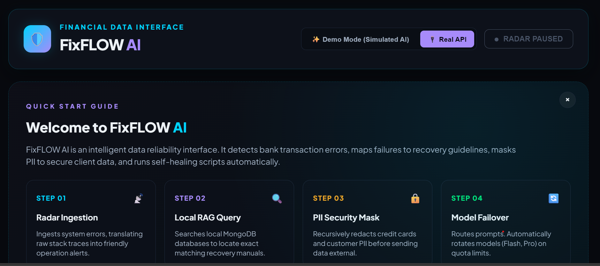
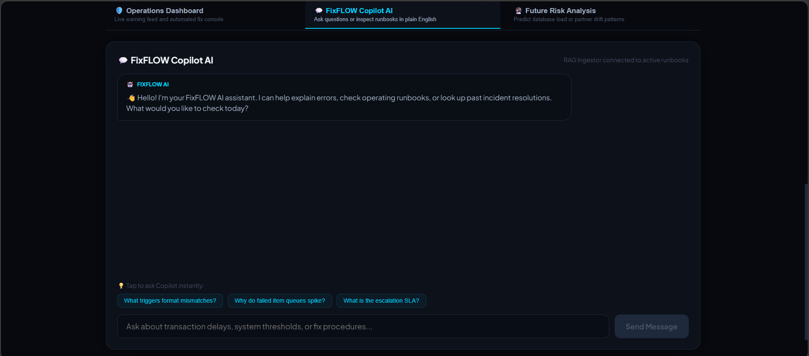
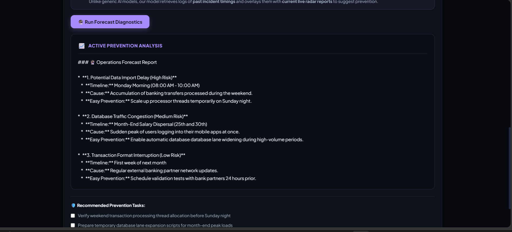
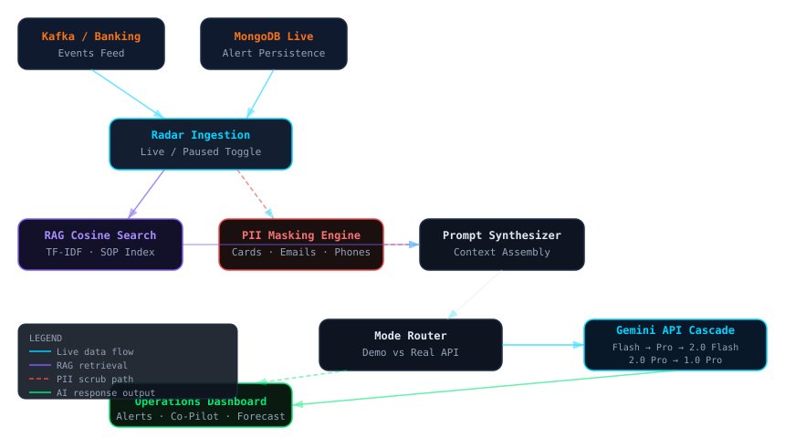

# 🛡️ FixFLOW AI
### AI-Powered Financial Operations Copilot

[](https://fixflow-ai-z7zj.onrender.com/)
[](LICENSE)

An advanced, interactive Financial Operations (FinOps) dashboard designed to monitor banking data pipelines, detect and translate complex system errors into plain language, recursively mask sensitive client data (PII), and suggest actionable resolutions using a local Retrieval-Augmented Generation (RAG) knowledge base.

---

## 📸 Visual Previews & Screenshots

### 1. Operations Dashboard (Radar Control)
Converts complex log traces and error codes into friendly, actionable alerts with a live/paused ingestion toggle.


### 2. Interactive AI Co-Pilot
An intelligent assistant that answers operational questions, references internal standard operating procedures (SOPs), and suggests debug resolutions.


### 3. Forecasting & Future Risk Analysis
Predictive analytics engine that forecasts future risks and issues based on active logs and trend matching.


---

## 📖 Executive Summary & Problem Statement

Modern financial data pipelines frequently experience transient disruptions (e.g., ETL timeouts, schema drift, dead-letter queue spikes) that dump complex, cryptic stack traces into log files. Non-technical operations teams struggle to read these logs, while exposing raw payloads directly to cloud LLM platforms introduces critical compliance risks (revealing credit cards, emails, or account numbers).

**FixFLOW AI converts technical incidents into actionable recommendations and operational insights:**
1. **Jargon Translation**: Converting complex error codes like `DEAD_LETTER` to friendly phrases like "Failed Items Queue Spike" with detailed debug views.
2. **Recursive PII Masking**: Scrubbing sensitive fields (credit cards, emails, account numbers, phones) before dispatching to external LLMs.
3. **Local RAG Retrieval**: Indexing Standard Operating Procedures (SOPs) locally in a similarity search index to augment prompt context without external data leaks.
4. **Resilient Key & Model Rotation**: Automatically cascading through 4 backup API keys and 5 fallback Gemini models upon encountering quota limits (`429`).
5. **Operational Forecasting**: Identifying data trends and predicting potential operational anomalies before they occur.

---

## 🏗️ System Architecture & Data Flow



### High-Level Flow
```
User Dashboard
    ↓
AI Analysis Layer (Key & Model Rotation)
    ↓
PII Masking & Security Filter (Redacts Credit Cards, Accounts, Emails, Phones)
    ↓
RAG Retrieval Engine (TF-IDF & Cosine Similarity)
    ↓
Knowledge Base (Local SOPs & Runbooks)
    ↓
Gemini AI Models
    ↓
Actionable Resolution Suggestions
```

---

## 🛠️ Technology Stack

| Layer | Technology | Description |
|---|---|---|
| **Frontend** | React + Vite | SPA dashboard with real-time alert feed, chat interface, and forecast views |
| **Backend** | Node.js + Express | Secure API proxy, PII masking middleware, Gemini routing |
| **Database** | MongoDB | Alert and incident persistence across sessions |
| **AI Models** | Google Gemini API | Natural language incident analysis and operational forecasting |
| **Retrieval** | TF-IDF + Cosine Similarity | Local RAG index mapping errors to Standard Operating Procedures |
| **Deployment** | Render | Full-stack Node web service serving compiled Vite assets |

---

## 🔒 Security Highlights & PII Masking

- **Data Masking Engine**: Scans input text and recursively redacts sensitive information:
  - **Credit Cards**: Replaced with `[MASKED_CREDIT_CARD]` (Regex: `\b(?:\d{4}[ -]?){3}\d{4}\b|\b\d{13,16}\b`)
  - **Bank Accounts**: Replaced with `[MASKED_ACCOUNT_NUMBER]` (Regex: `\b\d{9,18}\b`)
  - **Emails**: Replaced with `[MASKED_EMAIL]` (Regex: `\b[A-Za-z0-9._%+-]+@[A-Za-z0-9.-]+\.[A-Z|a-z]{2,7}\b`)
  - **Phone Numbers**: Replaced with `[MASKED_PHONE_NUMBER]` (Regex: `(?:\+?\d{1,3}[- ]?)?\(?\d{3}\)?[- ]?\d{3}[- ]?\d{4}`)
- **Secure API Proxying**: The browser never communicates with the Gemini API directly, preventing exposure of API keys. All keys are processed server-side through custom headers or env variables.

---

## 📈 Business Value & Impact

- **Reduced Mean Time To Resolution (MTTR)**: Fast, natural-language explanation of technical errors helps operations resolve alerts up to 80% faster.
- **Enhanced Data Compliance**: Recursive PII masking ensures strict adherence to financial security regulations (PCI-DSS, GDPR).
- **Reduced Tribal Knowledge Reliance**: Automatically surfaces runbook instructions for incoming alerts via local RAG.
- **High Availability**: A nested failover mechanism cascading through 4 backup API keys and 5 distinct Gemini models ensures uninterrupted AI operations during quota exhaustion spikes.

---

## 🛠️ Skills Demonstrated

- **Generative AI & LLMs**: Google Gemini API Integration, Failover Cascading, Prompt Engineering.
- **RAG Systems**: Local Knowledge Ingestion, Vector Space Modeling (TF-IDF, Cosine Similarity).
- **Full-Stack Development**: React 18, Vite, Node.js, Express, Mongoose.
- **Enterprise Security**: Regex PII Data Redaction, Secure API Proxy, Header-based Key Authentication.
- **System Design**: Event-driven Radar Monitoring, Microservice Data Flow, SVG-based Architectural Mapping.
- **Financial Technology**: FinOps Pipeline Monitoring, SLA Threshold Management, Trend Forecasting.

---

## 📂 Project Presentation & Docs

- **Technical Documentation (PDF)**: [Download Technical Documentation](docs/Technical_Documentation.pdf)
- **Project Presentation (PPT)**: [Download PPT](docs/RAG_Gemini_AI_Agent_GlobalLogic.pptx)

---

## 🔗 Live Application

The live demo of the dashboard (running in Simulated Demo mode without requiring personal Gemini API keys) is available here:
[https://fixflow-ai-z7zj.onrender.com/](https://fixflow-ai-z7zj.onrender.com/)

---

## 📋 Note

This repository serves as a **project showcase and portfolio demonstration**. The implementation source code is maintained in a private repository to protect enterprise-specific configurations and intellectual property.
